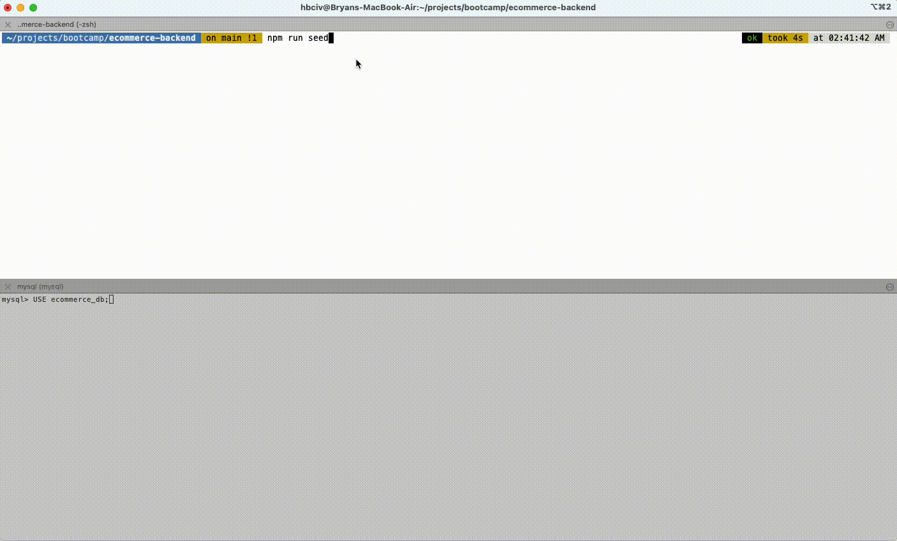
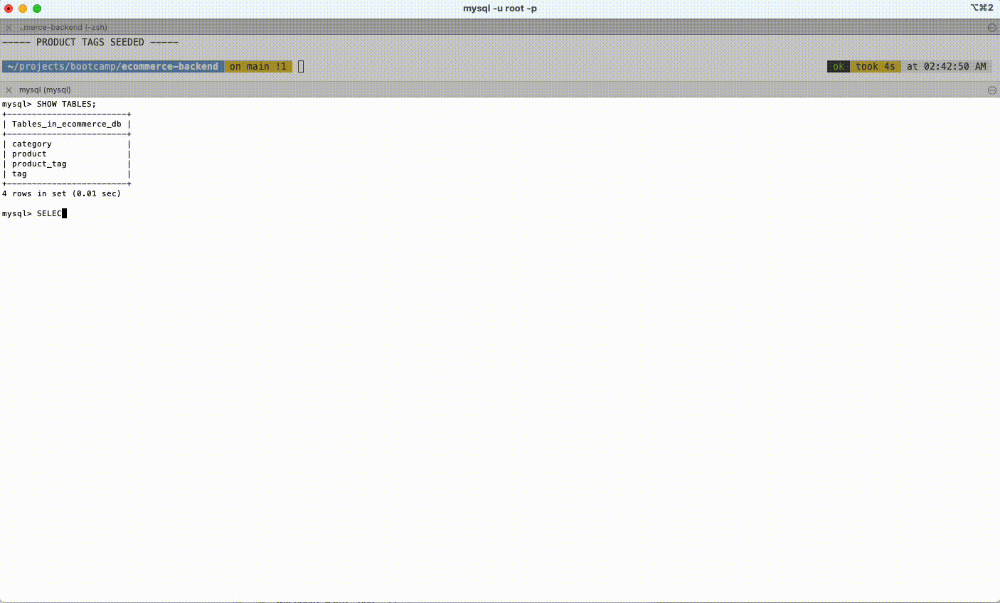
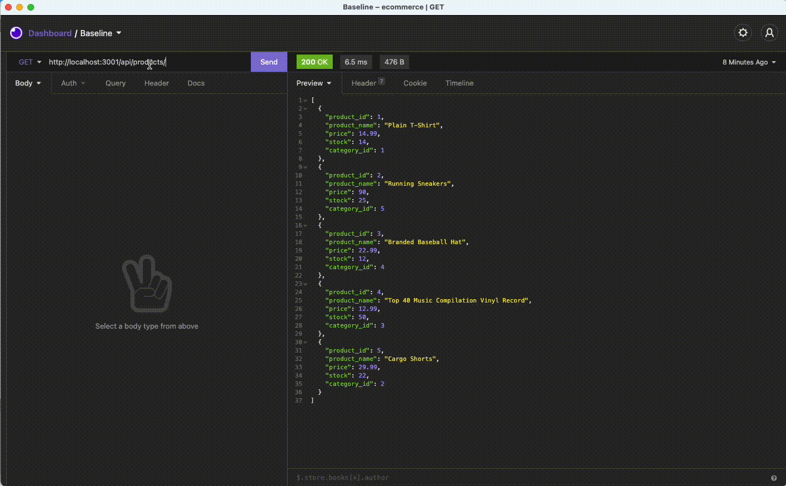
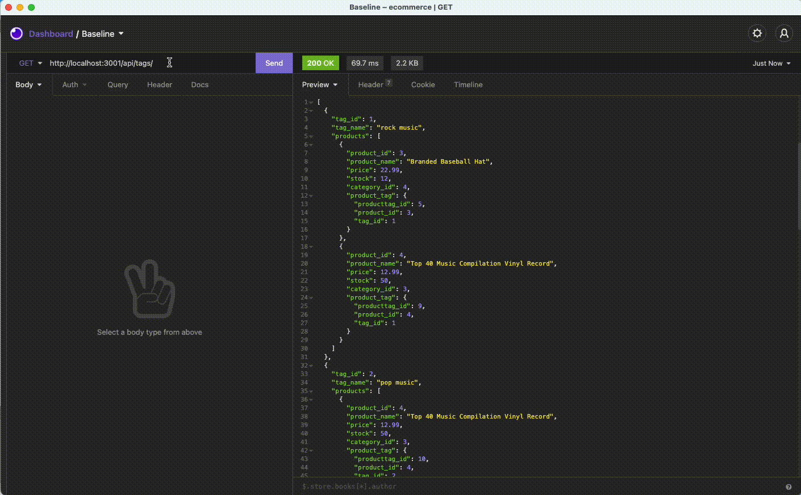
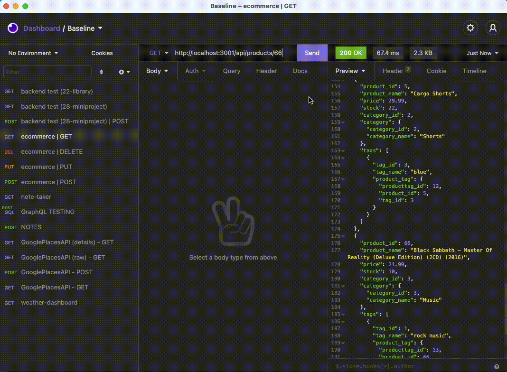
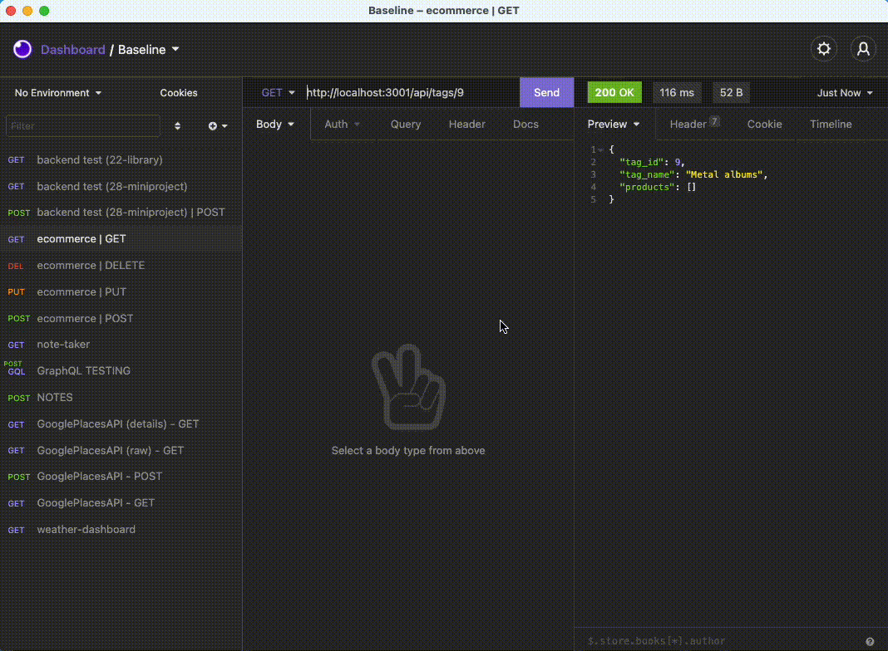
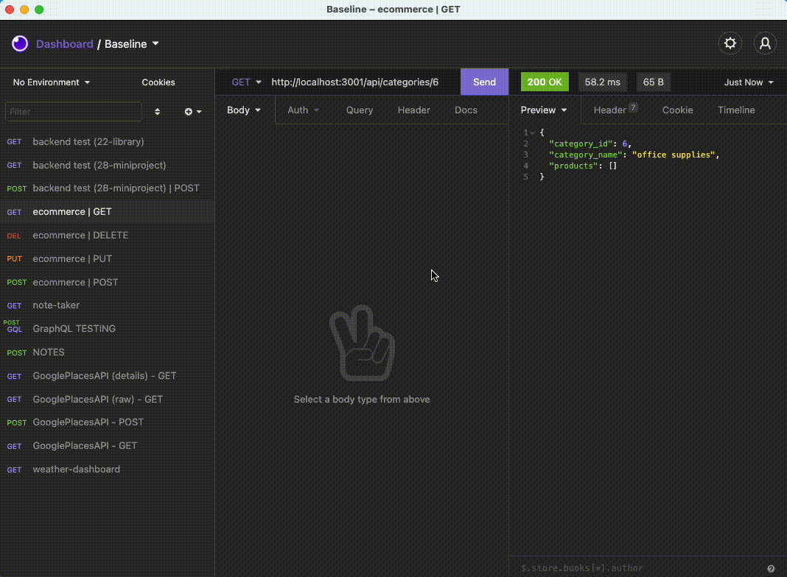
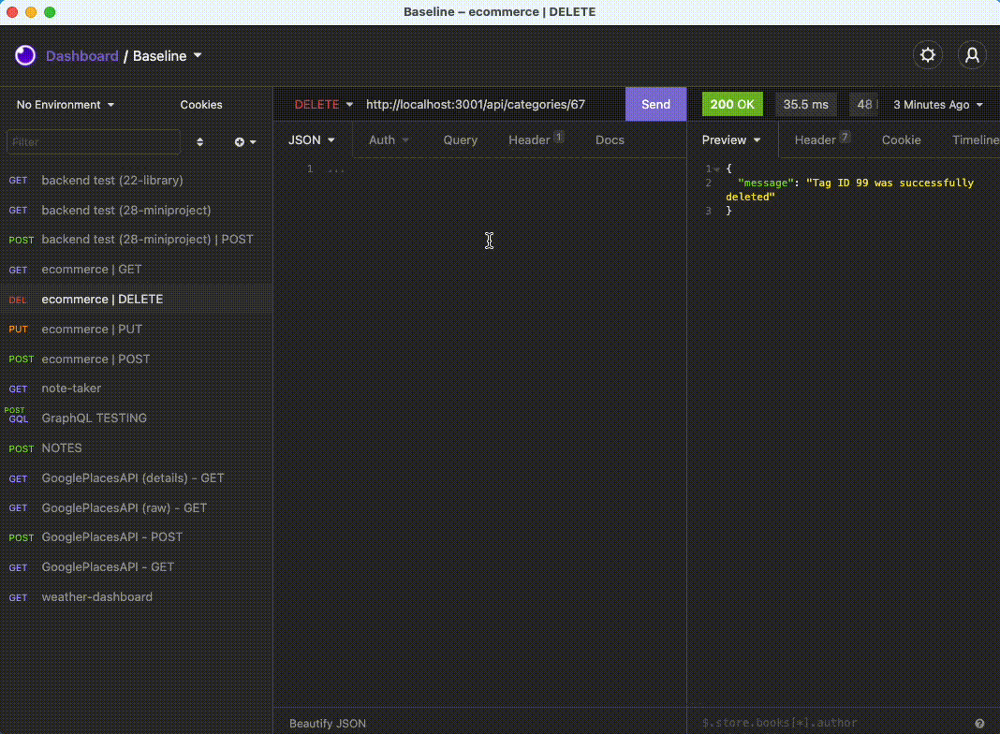

# ecommerce-backend

## Description

To support functionality and efficient data storage and handling to an ecommerce website, a backend must be designed to utilize database calls retrieving, storing, updating and deleting various tasks related to products, pricing, inventory and more.  

In this exercise students will design a demonstration ecommerce backend using the following technologies:

* [Node.js](https://nodejs.dev/)
* [Express](http://expressjs.com/)
* [MySQL](https://www.mysql.com/)
* [Sequelize](https://sequelize.org/master/)

## Requirements

* Students must create a suitable MySQL database and tables for the following ecommerce-related data:

	* Categories
	* Products
	* Tags
	* Product Tags
* Database calls must be made using ORM solution Sequelize
* Students will configure schema, models and seeing actions (seeds are provided)
* Students will configure routes for performing CRUD methods on database tables

## Installation

1. [Fork the repository](https://github.com/monstertruckdog/team-profile-generator) to a local directory
2. In your terminal, navigate to the repository directory and execute the following command:

 ```shell
 npm i
 ```

3. Start up a MySQL instance locally so that the database can be created
4. Open a new command line terminal window or tab and seed the database by executing the following command in the terminal:

  ```shell
  npm run seed
  ```

5. In another new command line terminal window or tab (or the first terminal window/tab), start the backend server:

  ```shell
  node server.js
  ```

6. Download and open one of the widely used API testing clients [Postman](https://www.postman.com/downloads/) or [Insomnia](https://insomnia.rest/)
7. Execute GET, POST, PUT and DELETE methods as desired:

      ### GET
  
   * **PRODUCTS**:  `http://localhost:3001/api/products`
   * **CATEGORIES**:  `http://localhost:3001/api/categories`
   * **TAGS**:  `http://localhost:3001/api/tags`

    ### GET by ID
    * **PRODUCTS**:  `http://localhost:3001/api/products/<product id value here>`
    * **CATEGORIES**:  `http://localhost:3001/api/categories/<category id value here>`
    * **TAGS**:  `http://localhost:3001/api/tags/<tag id value here>`
   
    ### POST
  
    * **PRODUCTS**:  `http://localhost:3001/api/products`
    
      * Form data format:
 
      ```JSON
      {
			  "product_id": 1,
            "product_name": "Plain T-Shirt",
			  "price": 14.99,
			  "stock": 14,
			  "category_id": 1,
			  "tagIds": [2, 3]
      }
		```
    * **CATEGORIES**:  `http://localhost:3001/api/categories`
    
      * Form data format:
 
      ```JSON
      {
			  "category_id": 41,
            "category_name": "board games"
      }
		```
    * **TAGS**:  `http://localhost:3001/api/tags`
    
      * Form data format:
 
      ```JSON
      {
			  "tag_id": 16,
            "tag_name": "art"
      }
		```

    ### PUT

    * **PRODUCTS**:  `http://localhost:3001/api/products/<product ID value to be modified>`
      * Form data format:
  
    ```JSON
            {
			        "product_id": 84,
                    "product_name": "Oxford Dress Shirt",
			        "price": 59.99,
			        "stock": 4,
			        "category_id": 1,
			        "tagIds": [2, 3]
            }
    ```

    * **CATEGORIES**:  `http://localhost:3001/api/categories/<category ID value to be modified>`

      * Form data format:

    ```JSON
            {
                "category_id": 17,
                "category_name": "board games"
            }
    ```

    * **TAGS**:  `http://localhost:3001/api/tags/<tag ID value to be modified>`

      * Form data format:
    ```JSON
            {
                "tag_id": 23,
                "category_name": "tool"
            }
    ```

    ### DELETE

    * **PRODUCT**:  `http://localhost:3001/api/products/<product ID value to be deleted`
    * **CATEGORY**:  `http://localhost:3001/api/categories/<category ID value to be deleted`
    * **TAG**:  `http://localhost:3001/api/tags/<tag ID value to be deleted`

## Usage

##### Create and seed database; verify tables are created



##### Verify seed data in each table



##### Start server


##### GET methods:  categories, tags and products


* **GET by ID:  products**
  

* **GET by ID:  tags**
  

* **GET by ID:  categories**
  
  
##### POST methods

* **POST:  products**
    
    
* **POST:  tags**
  
  
* **POST:  categories**
  

##### PUT methods:  products, tags, categories

* **PUT:  products**
  
  
* **PUT:  tags**
  
  
* **PUT:  category**
  

##### DELETE methods:  products, tags, categories

* **DELETE:  product**
  

* **DELETE:  tag**
  
  
* **DELETE:  category**
  
  

## Contact

* GitHub:  [link](https://github.com/monstertruckdog/ecommerce-backend)
* Email:  *see GitHub page*