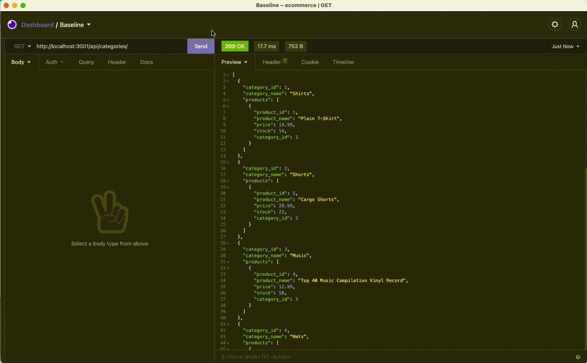

# ecommerce-backend

## Description

To support functionality and efficient data storage and handling to an ecommerce website, a backend must be designed to utilize database calls retrieving, storing, updating and deleting various tasks related to products, pricing, inventory and more.  

In this exercise students will design a demonstration ecommerce backend using the following technologies:

* [Node.js](https://nodejs.dev/)
* [Express](http://expressjs.com/)
* [MySQL](https://www.mysql.com/)
* [Sequelize](https://sequelize.org/master/)

## Requirements

* Students must create a suitable MySQL database and tables for the following ecommerce-related data:

	* Categories
	* Products
	* Tags
	* Product Tags
* Database calls must be made using ORM solution Sequelize
* Students will configure schema, models and seeing actions (seeds are provided)
* Students will configure routes for performing CRUD methods on database tables

## Installation

## Usage

##### Create and seed database; verify tables are created

##### Verify seed data in each table

##### Start server

##### GET methods:  categories, tags and products

* **GET by ID:  products**
  

* **GET by ID:  tags**
  

* **GET by ID:  categories**
  
  
##### POST methods

* **POST by ID:  products**
    ![